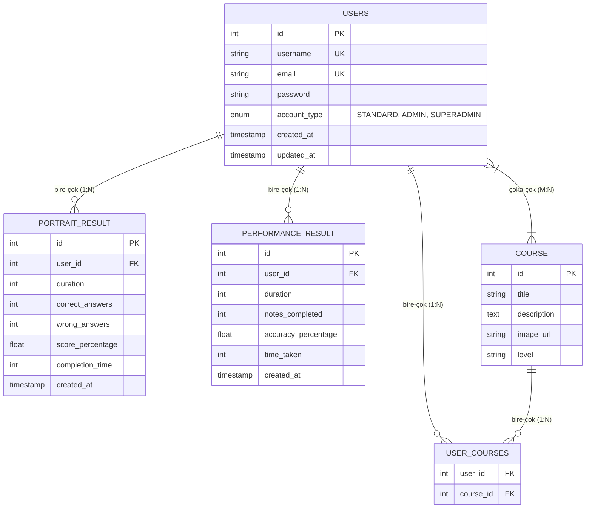

# HIZLI KLARNET METODU - Veritabanı Entity Relationship Diagram (ERD)

Bu dosya, HIZLI KLARNET METODU projesinin veritabanı şemasını gösteren Mermaid ERD diyagramını içermektedir.

## Kullanım

Bu kodu [Mermaid Live Editor](https://mermaid.live/) sitesine kopyalayıp yapıştırarak görsel diyagramı oluşturabilirsiniz.

## Mermaid ERD Kodu



## İlişki Açıklamaları

### Bire Çok İlişkiler (One-to-Many - 1:N):
- **USERS → PORTRAIT_RESULT (1:N)**: Bir kullanıcının birden fazla portre quiz sonucu olabilir
- **USERS → PERFORMANCE_RESULT (1:N)**: Bir kullanıcının birden fazla performans quiz sonucu olabilir
- **USERS → USER_COURSES (1:N)**: Bir kullanıcının birden fazla ders kaydı olabilir
- **COURSE → USER_COURSES (1:N)**: Bir derse birden fazla kullanıcı kaydı olabilir

### Çoka Çok İlişki (Many-to-Many - M:N):
- **USERS ↔ COURSE (M:N)**: Bir kullanıcı birden fazla derse kayıt olabilir, bir derse birden fazla kullanıcı kayıt olabilir
  - Bu ilişki `USER_COURSES` ara tablosu üzerinden kurulur
  - Ara tablo, kullanıcı-ders eşleştirmelerini saklar

## Görsel Dosya Oluşturma

1. Yukarıdaki Mermaid kodunu kopyalayın (```mermaid ve ``` arasındaki kısmı)
2. [Mermaid Live Editor](https://mermaid.live/) adresine gidin
3. Kodu yapıştırın
4. "Actions" menüsünden "Download PNG" veya "Download SVG" seçeneğini kullanın
5. İndirilen dosyayı proje klasörüne ekleyin
